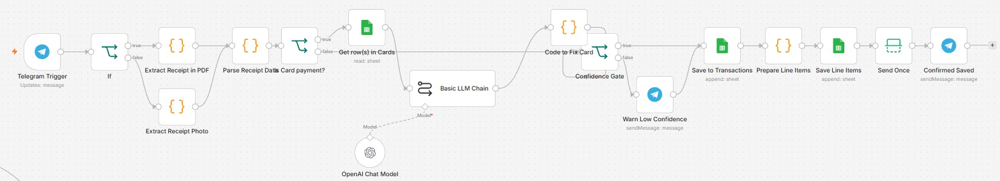
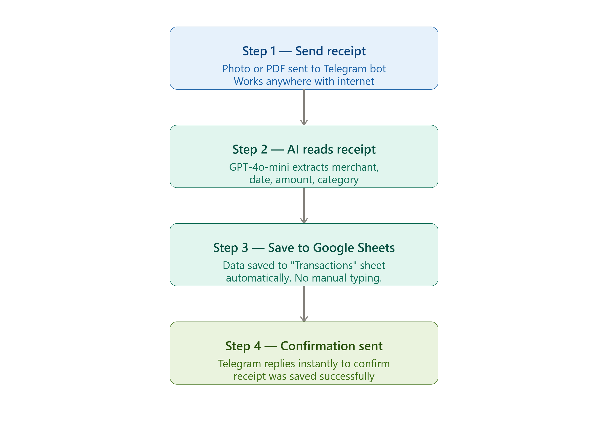

*From manual desktop entry to snapping a photo anywhere — how I automated my receipt tracking with n8n, Telegram, and GPT-4o-mini.*

## The Problem

Like many people, I used to record my expenses manually 
using Microsoft Access on my desktop. It worked, but it 
had one big limitation — I had to be at my desk to do it.

If I paid for parking at a shopping mall, I had to 
remember to key in the receipt later when I got home. 
Sometimes I forgot. Sometimes the receipt got lost. 
The data was never complete.

I wanted something simpler. Something I could do 
anywhere, anytime, with just my phone.

## The Solution

I built an automated receipt extraction workflow using 
n8n, Telegram, and an AI language model.

Now all I do is take a photo of my receipt and send 
it to a Telegram bot. The rest happens automatically.

No desktop required. No manual typing. Works anywhere 
as long as I have internet connection.

## How It Works

*Figure: My actual receipt extraction workflow built in n8n*

*Figure: Simplified flow for easy reading*

**Step 1 — Send receipt**
I take a photo of the receipt or forward a PDF receipt 
directly into my Telegram bot. The workflow accepts 
both image and PDF formats.

**Step 2 — AI reads receipt**
n8n picks up the message and sends it to GPT-4o-mini 
by OpenAI. The model reads the receipt and extracts 
all key information automatically — merchant name, 
date, amount, category, and payment mode.

**Step 3 — Save to Google Sheets**
The extracted data is automatically saved into a 
Google Sheet called "Transactions". Clean, organised, 
and ready for review anytime.

**Step 4 — Confirmation sent**
Once saved, Telegram sends me a confirmation message 
immediately so I know the receipt was processed 
successfully.

## Why GPT-4o-mini?

Choosing the right AI model comes down to one word 
for me — budget.

GPT-4o-mini by OpenAI gives very good accuracy at 
a fraction of the cost of more powerful models. 
If budget is not a concern, you can certainly use 
a more powerful model for even better accuracy. 
But for everyday receipts, GPT-4o-mini does the 
job well enough.

## Why Telegram and Not WhatsApp?

This is a question I get asked sometimes.

Honestly — I would love to use WhatsApp. Most people 
in Singapore use it daily. But Meta has made the 
WhatsApp Business API so complicated and expensive 
to set up for personal use that it simply is not 
practical.

Telegram, on the other hand, has a free and easy 
bot API that anyone can set up in minutes. For 
automation purposes, Telegram wins hands down.

Note: This same workflow can be adapted to trigger 
an email confirmation instead of Telegram — the 
choice is yours.

## What Receipts Can It Process?

The workflow handles any type of receipt — parking, 
groceries, restaurants, utility bills, petrol and more.

However, I use it selectively. I focus mainly on 
credit card transactions because I have a separate 
bank statement reconciliation workflow that matches 
my credit card receipts against my bank statement 
automatically. This combination cuts my monthly 
financial processing time significantly.

For cash payments, I rarely track them — keeping 
things simple and practical.

## A Word of Caution

As with any AI extraction, accuracy is not guaranteed 
at 100%. Blurry photos, unusual receipt formats, or 
handwritten receipts may cause errors.

Always do a quick review of extracted data before 
treating it as final. The time saved versus manual 
entry is still significant even with occasional 
corrections.

## What I Learned

Automation does not have to be all or nothing. 
I selectively automate what gives me the most 
value — credit card receipts — and skip what 
does not — cash payments.

Start small. Automate one thing well. Then expand 
when you are ready.

If a part-time teacher from Singapore can build 
this, so can you.

— KW
